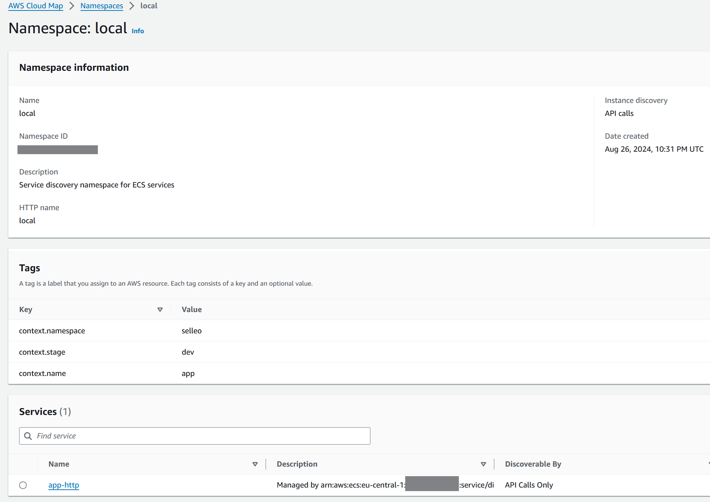

# Service Discovery with ECS



Service name, port name and port together form a unique discovery endpoint:
```
service_name-port_name:port
```

<!-- BEGIN_TF_DOCS -->
## Requirements

| Name | Version |
|------|---------|
| <a name="requirement_terraform"></a> [terraform](#requirement\_terraform) | ~> 1.0 |
| <a name="requirement_aws"></a> [aws](#requirement\_aws) | ~> 5.0 |

## Providers

| Name | Version |
|------|---------|
| <a name="provider_aws"></a> [aws](#provider\_aws) | 5.90.1 |

## Modules

| Name | Source | Version |
|------|--------|---------|
| <a name="module_lb"></a> [lb](#module\_lb) | ../../modules/lb/alb | n/a |
| <a name="module_public_subnets"></a> [public\_subnets](#module\_public\_subnets) | ../../modules/vpc-public-subnet | n/a |
| <a name="module_secrets"></a> [secrets](#module\_secrets) | ../../modules/ssm/parameters | n/a |
| <a name="module_static_cluster"></a> [static\_cluster](#module\_static\_cluster) | ../../modules/ecs-cluster-static | n/a |
| <a name="module_static_service"></a> [static\_service](#module\_static\_service) | ../../modules/ecs-service-managed | n/a |
| <a name="module_vpc"></a> [vpc](#module\_vpc) | ../../modules/vpc | n/a |

## Resources

| Name | Type |
|------|------|
| [aws_alb_listener.http](https://registry.terraform.io/providers/hashicorp/aws/latest/docs/resources/alb_listener) | resource |
| [aws_service_discovery_http_namespace.local](https://registry.terraform.io/providers/hashicorp/aws/latest/docs/resources/service_discovery_http_namespace) | resource |

## Outputs

| Name | Description |
|------|-------------|
| <a name="output_lb_dns"></a> [lb\_dns](#output\_lb\_dns) | n/a |
<!-- END_TF_DOCS -->